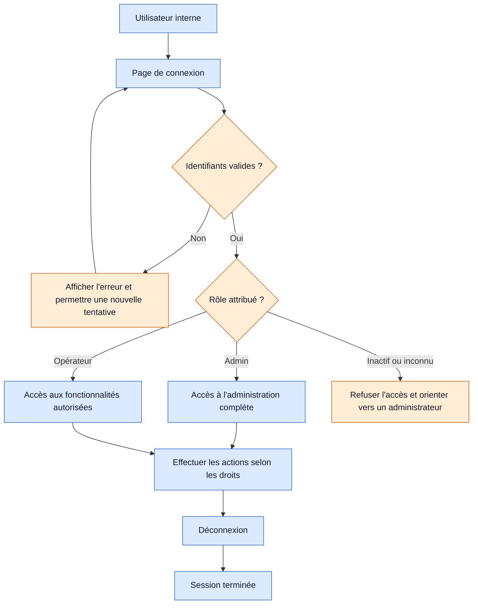

# Workflow 01 — Connexion et rôles

**Priorité :** P0 · **Rôles :** administrateur, opérateur

```mermaid
flowchart TD
    A[Utilisateur interne] --> B[Page de connexion]
    B --> C{Identifiants valides ?}
    C -- Non --> D[Afficher l'erreur et permettre une nouvelle tentative]
    D --> B
    C -- Oui --> E{Rôle attribué ?}
    E -- Admin --> F[Accès à l'administration complète]
    E -- Opérateur --> G[Accès aux fonctionnalités autorisées]
    E -- Inactif ou inconnu --> H[Refuser l'accès et orienter vers un administrateur]
    F --> I[Effectuer les actions selon les droits]
    G --> I
    I --> J[Déconnexion]
    J --> K[Session terminée]

    classDef internal fill:#dbeafe,stroke:#2563eb,color:#111827;
    classDef control fill:#ffedd5,stroke:#ea580c,color:#111827;
    class A,B,F,G,I,J,K internal;
    class C,D,E,H control;
```

À valider : droits par rôle, réinitialisation de mot de passe, révocation d'accès et MFA.
