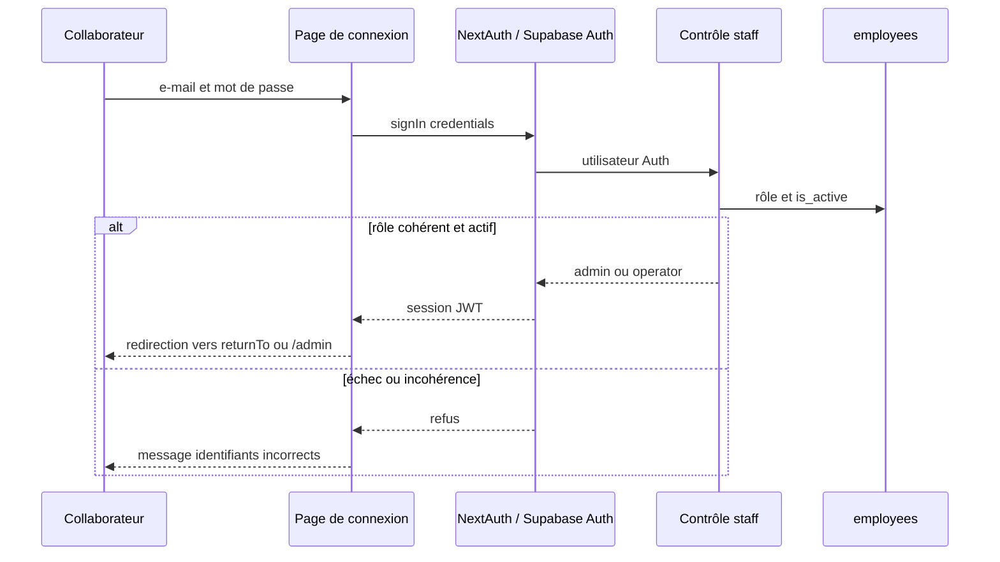

# Workflow 01 — Connexion, récupération et rôles

## Objectif

Donner accès au back-office aux seuls collaborateurs actifs. Les deux rôles applicatifs sont `admin` et `operator`; il n'existe pas de compte client connecté.

## Acteurs et autorisations

| Acteur | Droit constaté |
| --- | --- |
| Opérateur actif | Accès à `/admin` et aux API métier autorisées. |
| Administrateur actif | Même accès, plus `/admin/analytics`, `/admin/employees` et API administratives. |
| Compte Auth sans fiche active ou rôle incohérent | Connexion refusée. |

## Points d'entrée

- Page `GET /admin/login` et callback `POST /api/auth/callback/credentials`.
- Page publique `GET /admin/reset-password`, utilisable seulement avec une session de récupération Supabase valide.
- Proxy `proxy.ts` pour la redirection et le rate limit ; contrôles serveur dans `lib/staff-api-auth.ts`.

## Déroulé

1. Le collaborateur soumet son e-mail et son mot de passe à NextAuth.
2. Le provider vérifie le mot de passe auprès de Supabase Auth.
3. Le serveur lit ensuite `app_metadata.role` et la fiche `employees`. Le rôle doit être `admin` ou `operator`, la fiche doit être active et porter le même rôle.
4. Une session JWT de sept jours est créée ; le rôle est porté dans le jeton.
5. Le proxy redirige un visiteur non connecté vers `/admin/login?returnTo=…`. Il bloque l'accès opérateur aux pages Analytics et Collaborateurs.
6. Chaque handler sensible recalcule l'acteur actif : un compte désactivé après connexion n'est donc plus admis par ces handlers.

## Diagramme principal

## Règles métier et sécurité

- Limite de connexion : 5 tentatives par identifiant client sur 15 minutes, en mémoire du processus.
- Le rôle vient de `app_metadata`, jamais de `user_metadata`; la fiche `employees` sert aussi à vérifier l'activation.
- La page de réinitialisation exige un événement/session de récupération Supabase, impose 12 caractères et déconnecte ensuite les sessions locales.
- L'écran de connexion n'expose pas la raison précise d'un refus.

## Effets de bord

- Création de la session JWT ; aucun journal de connexion applicatif n'est créé par ce flux.
- La réinitialisation modifie le mot de passe Supabase Auth et déconnecte localement Supabase et NextAuth.

## Échecs et cas limites

- Identifiants invalides, compte désactivé, rôle absent ou divergent : refus indifférencié.
- `returnTo` n'est utilisé que s'il commence par `/`, ce qui limite les redirections externes.
- À confirmer : il n'y a pas de demande de lien de récupération, de MFA ni de révocation globale de sessions dans le dépôt.

## Tests de recette

1. Connecter un administrateur actif : vérifier l'accès à Analytics et Collaborateurs.
2. Connecter un opérateur actif : vérifier la redirection de ces deux pages vers `/admin` et l'accès aux commandes.
3. Désactiver une fiche collaborateur dans un environnement de test : vérifier qu'une requête API métier est refusée avec la session existante.
4. Ouvrir un lien de récupération valide, saisir deux mots de passe de moins de 12 puis au moins 12 caractères : vérifier les refus puis la déconnexion après succès.

## Références code

- `proxy.ts`, `lib/auth.ts`, `lib/staff-authorization.ts`, `lib/staff-api-auth.ts`
- `app/admin/login/page.tsx`, `app/admin/reset-password/page.tsx`
- `supabase/migrations/0001_initial_schema.sql` (table `employees`)
