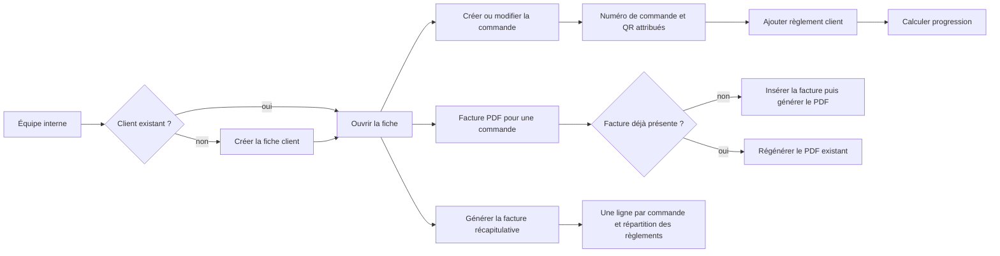

# Workflow 02 — Client, commande, règlement et facture

## Objectif

Gérer le client, sa commande logistique, ses règlements et les documents opérateur associés : facture PDF par commande, facture récapitulative et étiquette QR. Toutes ces opérations sont accessibles aux deux rôles internes.

## Acteurs et autorisations

| Acteur | Droits |
| --- | --- |
| Opérateur / administrateur actif | Lire, créer, modifier et supprimer clients/commandes; ajouter des règlements; générer les factures PDF et l’étiquette QR. |
| Visiteur | Aucun accès aux fiches ; seulement inscription et suivi public, documentés séparément. |

## Points d'entrée

- `GET, POST /api/customers`, `GET, PUT, DELETE /api/customers/[id]`
- `GET, POST /api/orders`, `GET, PUT, DELETE, PATCH /api/orders/[id]`
- `GET, POST /api/customers/[id]/payments` et `POST /api/customers/[id]/invoices`

## Déroulé

1. L'équipe crée ou retrouve un client. Nom, téléphone, adresse, ville, code postal et pays sont requis; l'e-mail est facultatif et normalisé.
2. À la création manuelle d'une commande, les coordonnées expéditeur et destinataire, le service, l'origine et la destination sont requis. Pour le fret maritime, l’opérateur peut sélectionner un conteneur existant ou laisser la commande non associée ; s’il n’existe aucun conteneur, il doit en créer un avant de pouvoir l’associer. Le serveur génère un numéro unique, avec jusqu'à cinq tentatives en cas de collision.
3. Une commande sans `customer_id` cherche d'abord le client par e-mail, puis crée une fiche active si nécessaire.
4. La commande commence à `pending`. Elle peut être affectée à un conteneur et recevoir des événements de suivi.
5. Les règlements sont enregistrés au niveau client, sans affectation à une commande. La fiche retourne un résumé calculé à partir des commandes et paiements.
6. L’action **Facture PDF** de la fiche client crée une facture brouillon si la commande n’en possède pas encore, puis génère le PDF. Si la facture existe déjà, elle régénère directement le PDF avec le même numéro, sans renvoyer l’opérateur vers une erreur de doublon.
7. L’action **Générer la facture** de la fiche crée un PDF récapitulatif de toutes les commandes du client. Chaque commande devient une ligne et les règlements sont répartis par ancienneté pour afficher le total réglé et le solde ; ce document récapitulatif n’insère pas de nouvelle facture en base.
8. L’action **Étiquette QR** ouvre le format d’impression PDF de production : logo Danemo, nom et prénom du destinataire, téléphone, destination, expéditeur, QR destiné au scanner opérateur et référence de commande.

## Diagramme principal

## Règles métier et sécurité

- Statuts client : `active`, `inactive`, `archived`; statuts commande : `pending`, `confirmed`, `in_progress`, `completed`, `cancelled`.
- Services autorisés à la création manuelle : fret maritime/aérien, déménagement, dédouanement, négoce, colis.
- Une association de conteneur est admise uniquement pour `fret_maritime`. L’API vérifie que l’identifiant sélectionné existe et la base maintient elle-même `container_code` depuis `container_id`.
- Le règlement est strictement positif, en EUR, daté au format `YYYY-MM-DD`, avec l'un des modes `bank_transfer`, `cash`, `card`, `mobile`, `other`.
- La route de création de facture vérifie l'appartenance de la commande au client, refuse une valeur négative/non numérique et empêche le doublon par commande. L’interface contourne ce cas en utilisant la facture existante pour produire le PDF.
- Les PDF de facture utilisent le générateur commun `generateInvoice`, avec les adresses de facturation/livraison, les lignes de commande, TVA, total, paiements et solde.
- Les créations, modifications et suppressions de client/commande, ainsi que les paiements, alimentent `business_audit_log` lorsqu'il est disponible.

## Effets de bord

- Les triggers SQL génèrent un QR de commande, maintiennent le code conteneur et enregistrent les changements de commande dans `order_history`.
- Une mise à jour de statut de commande via `ordersApi.update` peut déclencher une notification e-mail; l'échec ne doit pas annuler la mise à jour.
- Le calcul de TVA et le numéro de facture sont des triggers SQL. La facture récapitulative est un export PDF opérateur et ne crée pas de ligne `invoices` supplémentaire.

## Échecs et cas limites

- Email client dupliqué : la contrainte DB peut refuser la création; l'inscription publique retourne explicitement 409.
- Un règlement n'est ni modifiable ni supprimable par route dédiée dans le dépôt : une erreur de saisie exige aujourd'hui une correction administrée en dehors de ce flux. **À confirmer.**
- Un appel direct répété à `POST /api/customers/[id]/invoices` reste refusé avec HTTP 409 ; la réutilisation du PDF est un comportement de la fiche client, pas une modification de ce contrat API.
- La suppression est physique et peut se propager selon les clés étrangères; elle n'est pas limitée à l'administrateur.

## Tests de recette

1. Créer client puis commande, contrôler le statut `pending`, le numéro unique et la présence d'un QR. Pour une commande de fret maritime, sélectionner un conteneur existant et vérifier l’association et le code conteneur retournés.
2. Créer une commande sans `customer_id` pour un e-mail connu puis inconnu : contrôler réutilisation puis création de fiche.
3. Ajouter un règlement valide, puis montant nul, date invalide et mode inconnu : contrôler 201 puis 400.
4. Depuis la fiche client, générer une **Facture PDF** deux fois pour la même commande : contrôler que le second clic régénère le PDF avec la même référence, sans erreur visible.
5. Appeler directement l’API de création de facture deux fois : contrôler 201 puis 409.
6. Générer la facture récapitulative : contrôler une ligne par commande et des montants réglé/solde cohérents avec la progression affichée sur la fiche.
7. Générer l’étiquette QR et vérifier que le scan préremplit le code dans le scanner opérateur.
8. Vérifier dans `business_audit_log` les événements créés en environnement de test.

## Références code

- `app/api/customers/route.ts`, `app/api/customers/[id]/route.ts`, `app/api/customers/[id]/payments/route.ts`, `app/api/customers/[id]/invoices/route.ts`
- `app/api/orders/route.ts`, `app/api/orders/[id]/route.ts`, `app/admin/clients/[id]/page.tsx`, `lib/customer-payment-progress.ts`, `lib/invoice-utils.ts`, `lib/client-documents.ts`, `lib/database.ts`, `lib/business-audit.ts`
- `supabase/migrations/0001_initial_schema.sql`, `supabase/migrations/20260902090000_add_customer_payments.sql`
