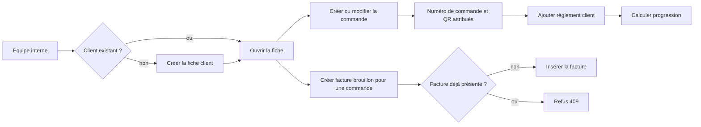

# Workflow 02 — Client, commande, règlement et facture

## Objectif

Gérer le client, sa commande logistique, ses règlements et une facture brouillon éventuelle. Toutes ces opérations sont accessibles aux deux rôles internes.

## Acteurs et autorisations

| Acteur | Droits |
| --- | --- |
| Opérateur / administrateur actif | Lire, créer, modifier et supprimer clients/commandes; ajouter des règlements; créer une facture brouillon. |
| Visiteur | Aucun accès aux fiches ; seulement inscription et suivi public, documentés séparément. |

## Points d'entrée

- `GET, POST /api/customers`, `GET, PUT, DELETE /api/customers/[id]`
- `GET, POST /api/orders`, `GET, PUT, DELETE, PATCH /api/orders/[id]`
- `GET, POST /api/customers/[id]/payments` et `POST /api/customers/[id]/invoices`

## Déroulé

1. L'équipe crée ou retrouve un client. Nom, téléphone, adresse, ville, code postal et pays sont requis; l'e-mail est facultatif et normalisé.
2. À la création manuelle d'une commande, les coordonnées expéditeur et destinataire, le service, l'origine et la destination sont requis. Le serveur génère un numéro unique, avec jusqu'à cinq tentatives en cas de collision.
3. Une commande sans `customer_id` cherche d'abord le client par e-mail, puis crée une fiche active si nécessaire.
4. La commande commence à `pending`. Elle peut être affectée à un conteneur et recevoir des événements de suivi.
5. Les règlements sont enregistrés au niveau client, sans affectation à une commande. La fiche retourne un résumé calculé à partir des commandes et paiements.
6. Une facture brouillon peut être créée une seule fois par commande, à partir de la valeur de celle-ci et d'un taux de taxe de 0 à 100.

## Diagramme principal

## Règles métier et sécurité

- Statuts client : `active`, `inactive`, `archived`; statuts commande : `pending`, `confirmed`, `in_progress`, `completed`, `cancelled`.
- Services autorisés à la création manuelle : fret maritime/aérien, déménagement, dédouanement, négoce, colis.
- Le règlement est strictement positif, en EUR, daté au format `YYYY-MM-DD`, avec l'un des modes `bank_transfer`, `cash`, `card`, `mobile`, `other`.
- La facture vérifie l'appartenance de la commande au client, refuse une valeur négative/non numérique et empêche le doublon par commande.
- Les créations, modifications et suppressions de client/commande, ainsi que les paiements, alimentent `business_audit_log` lorsqu'il est disponible.

## Effets de bord

- Les triggers SQL génèrent un QR de commande, maintiennent le code conteneur et enregistrent les changements de commande dans `order_history`.
- Une mise à jour de statut de commande via `ordersApi.update` peut déclencher une notification e-mail; l'échec ne doit pas annuler la mise à jour.
- Le calcul de TVA et le numéro de facture sont des triggers SQL.

## Échecs et cas limites

- Email client dupliqué : la contrainte DB peut refuser la création; l'inscription publique retourne explicitement 409.
- Un règlement n'est ni modifiable ni supprimable par route dédiée dans le dépôt : une erreur de saisie exige aujourd'hui une correction administrée en dehors de ce flux. **À confirmer.**
- La suppression est physique et peut se propager selon les clés étrangères; elle n'est pas limitée à l'administrateur.

## Tests de recette

1. Créer client puis commande, contrôler le statut `pending`, le numéro unique et la présence d'un QR.
2. Créer une commande sans `customer_id` pour un e-mail connu puis inconnu : contrôler réutilisation puis création de fiche.
3. Ajouter un règlement valide, puis montant nul, date invalide et mode inconnu : contrôler 201 puis 400.
4. Créer une facture pour une commande du client, puis recommencer : contrôler 201 puis 409.
5. Vérifier dans `business_audit_log` les événements créés en environnement de test.

## Références code

- `app/api/customers/route.ts`, `app/api/customers/[id]/route.ts`, `app/api/customers/[id]/payments/route.ts`, `app/api/customers/[id]/invoices/route.ts`
- `app/api/orders/route.ts`, `app/api/orders/[id]/route.ts`, `lib/customer-payment-progress.ts`, `lib/database.ts`, `lib/business-audit.ts`
- `supabase/migrations/0001_initial_schema.sql`, `supabase/migrations/20260902090000_add_customer_payments.sql`
