# Workflow 02 — Client, commande et règlement

**Priorité :** P0 · **Rôles :** administrateur, opérateur

```mermaid
flowchart LR
    A[Administrateur ou opérateur] --> B[Rechercher un client]
    B --> C{Fiche existante ?}
    C -- Non --> D["Créer le client<br/>statut et coordonnées"]
    D --> E{Données valides ?}
    E -- Non --> F[Corriger les champs signalés]
    F --> D
    E -- Oui --> G[Fiche client créée]
    C -- Oui --> H["Consulter la fiche<br/>commandes et historique"]
    G --> H
    H --> I[Mettre à jour la fiche si nécessaire]
    I --> J[Créer une commande]
    H --> J
    J --> K[Renseigner expéditeur, destinataire, service, colis, valeurs et dates]
    K --> L{Récapitulatif et contrôles métier validés ?}
    L -- Non --> K
    L -- Oui --> M[Enregistrer la commande]
    M --> N[Associer un conteneur si nécessaire]
    N --> O["Ajouter un règlement<br/>méthode, référence et montant"]
    O --> P[Calculer solde et progression de paiement]
    P --> Q{Correction nécessaire ?}
    Q -- Oui --> O
    Q -- Non --> R[Historique client et commande à jour]

    classDef internal fill:#dbeafe,stroke:#2563eb,color:#111827;
    classDef control fill:#ffedd5,stroke:#ea580c,color:#111827;
    class A,B,D,G,H,I,J,K,M,N,O,P,R internal;
    class C,E,F,L,Q control;
```

À valider : doublons clients, paiements partiels, droits de correction et données obligatoires.
