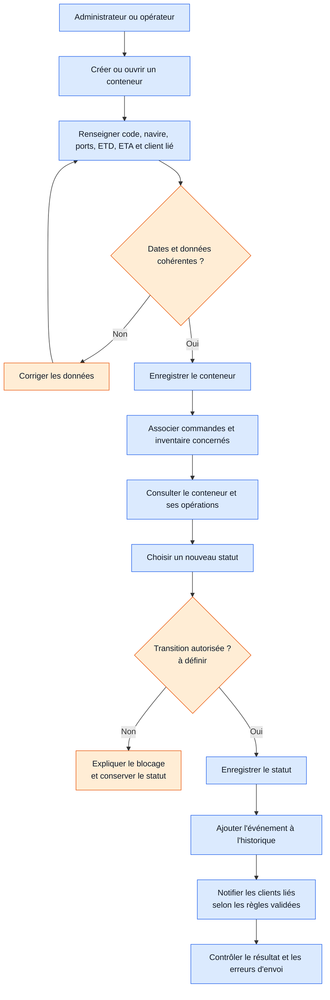

# Workflow 03 — Conteneur et changement de statut

**Priorité :** P0 · **Rôles :** administrateur, opérateur

```mermaid
flowchart TD
    A[Administrateur ou opérateur] --> B[Créer ou ouvrir un conteneur]
    B --> C[Renseigner code, navire, ports, ETD, ETA et client lié]
    C --> D{Dates et données cohérentes ?}
    D -- Non --> E[Corriger les données]
    E --> C
    D -- Oui --> F[Enregistrer le conteneur]
    F --> G[Associer commandes et inventaire concernés]
    G --> H[Consulter le conteneur et ses opérations]
    H --> I[Choisir un nouveau statut]
    I --> J{"Transition autorisée ?<br/>à définir"}
    J -- Non --> K["Expliquer le blocage<br/>et conserver le statut"]
    J -- Oui --> L[Enregistrer le statut]
    L --> M[Ajouter l'événement à l'historique]
    M --> N["Notifier les clients liés<br/>selon les règles validées"]
    N --> O[Contrôler le résultat et les erreurs d'envoi]

    classDef internal fill:#dbeafe,stroke:#2563eb,color:#111827;
    classDef control fill:#ffedd5,stroke:#ea580c,color:#111827;
    class A,B,C,F,G,H,I,L,M,N,O internal;
    class D,E,J,K control;
```

À valider : statuts officiels, transitions, destinataires et canaux de notification.
