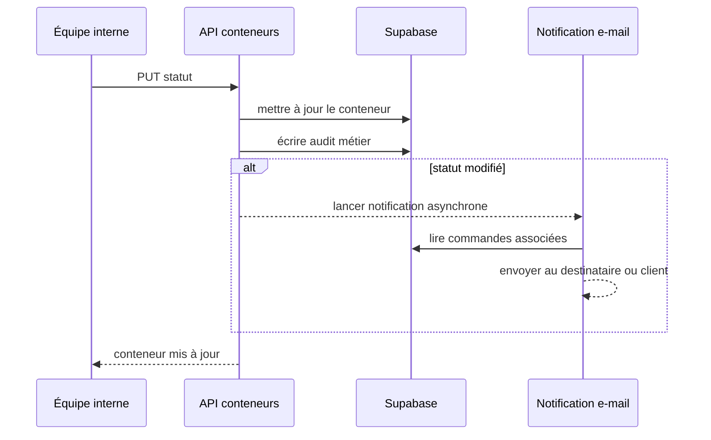

# Workflow 03 — Conteneur et changement de statut

## Objectif

Créer un transport conteneur, l'associer aux commandes et articles d'inventaire, puis communiquer les évolutions de statut aux destinataires des commandes associées.

## Acteurs et autorisations

| Acteur | Droit |
| --- | --- |
| Opérateur / administrateur actif | Créer, lire, modifier et supprimer un conteneur. |
| Visiteur | Lire la liste ou un conteneur dans sa représentation publique filtrée. |

## Points d'entrée

- `GET, POST /api/containers`; `GET, PUT, DELETE /api/containers/[id]`
- Association par `orders.container_id` et `inventory.container_id`.
- `POST /api/notifications/container-status` existe pour une notification déclenchée explicitement; la mise à jour du conteneur déclenche déjà son propre envoi asynchrone.

## Déroulé

1. L'équipe crée un conteneur : seul le code est vérifié par le handler; navire, ports, ETD, ETA, statut et client sont facultatifs.
2. Elle affecte des commandes et articles via leurs flux respectifs. Dans la fiche client, la commande de fret maritime propose uniquement les conteneurs existants ; sans conteneur disponible, l’opérateur doit d’abord en créer un.
3. Une mise à jour accepte les champs connus, dont `status`. Le conteneur est d'abord écrit puis audité.
4. Si le statut diffère de l'ancien, le serveur recherche les commandes du conteneur et tente un e-mail par commande à l'adresse destinataire, sinon client.
5. La réponse API est renvoyée sans attendre l'envoi e-mail.

## Diagramme principal

## Règles métier et sécurité

- Valeurs de statut stockées : `planned`, `departed`, `in_transit`, `arrived`, `delivered`, `delayed`.
- Le code conteneur est unique en base; le handler exige seulement qu'il ne soit pas vide.
- Les commandes liées reçoivent la préférence `recipient_email`, puis `client_email`; sans e-mail, elles sont ignorées.
- La liste publique retire les données définies par `toPublicContainer`; les utilisateurs internes reçoivent l'objet complet.

## Effets de bord

- Écriture dans `business_audit_log` pour création, mise à jour et suppression.
- E-mail de changement de statut, avec lien de suivi et message personnalisé facultatif.
- Les erreurs d'e-mail sont journalisées côté serveur, sans faire échouer la réponse de mise à jour.

## Échecs et cas limites

- Aucune transition d'état n'est contrôlée : tout statut admis par la contrainte SQL peut succéder à tout autre. **À confirmer avec l'exploitation.**
- Le `DELETE` est physique et autorisé aux opérateurs; vérifier les clés étrangères et l'impact sur les commandes/articles avant suppression.
- L'API publique par identifiant expose un conteneur si l'identifiant est connu : contrôler que `toPublicContainer` reste minimal.

## Tests de recette

1. Créer un conteneur sans code puis avec un code dupliqué : contrôler les erreurs.
2. Associer une commande ayant un e-mail de destinataire, modifier le statut et vérifier l'écriture avant la tentative d'e-mail.
3. Modifier le navire sans statut : vérifier qu'aucune notification de statut n'est demandée.
4. Appeler la lecture sans session et avec session : comparer les champs retournés.

## Références code

- `app/api/containers/route.ts`, `app/api/containers/[id]/route.ts`
- `lib/container-notifications.ts`, `lib/public-container.ts`, `lib/notification-templates.ts`, `lib/business-audit.ts`
- `supabase/migrations/0001_initial_schema.sql`
