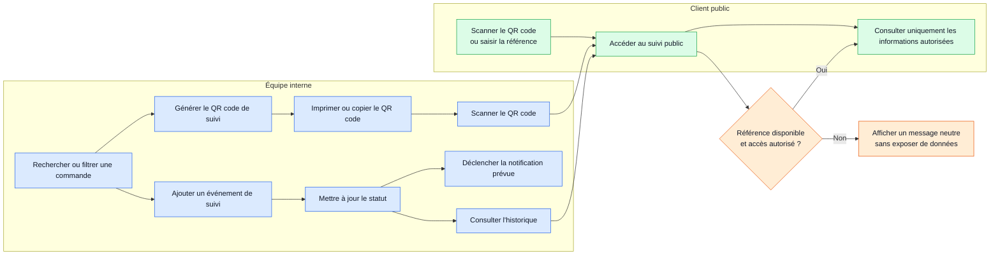

# Workflow 04 — Suivi, QR code et accès public

**Priorité :** P0 · **Rôles :** équipe interne, client public

À valider : informations publiées, durée de validité, erreurs de scan et corrections de suivi.
