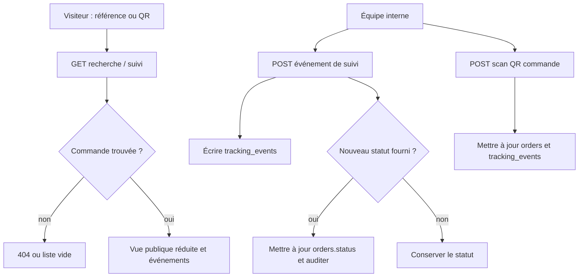

# Workflow 04 — Suivi, QR et accès public

## Objectif

Permettre à l'équipe de tracer une commande et à un visiteur de consulter un suivi réduit par numéro de commande, code conteneur ou QR de commande. Le scan QR interne résout une commande et enregistre un événement de suivi.

## Acteurs et autorisations

| Acteur | Droits |
| --- | --- |
| Visiteur | Recherche par référence et lecture des événements via une référence non UUID. |
| Opérateur / administrateur | Créer un événement, modifier le statut de commande, générer/récupérer un QR et scanner une commande. |

## Points d'entrée

- `GET /api/orders/search?tracking=…` : résultat public réduit.
- `GET /api/orders/[id]/tracking` : public pour référence non UUID, interne pour UUID; `POST` interne.
- `GET, PUT, PATCH /api/orders/[id]` et `POST /api/qr/scan`.

## Déroulé

1. Pour une recherche publique, le serveur cherche d'abord une commande par numéro, puis un premier résultat par code conteneur.
2. Il ne renvoie que référence, service, origine, destination, statut, date estimée, mise à jour et données de conteneur.
3. Les événements sont lus par UUID avec session, ou par QR/numéro/code conteneur sans session. L'identifiant public est résolu en identifiant de commande.
4. L'équipe ajoute un événement avec statut, lieu, description, opérateur et date. Un statut fourni différent met aussi à jour la commande et génère un audit.
5. Le `PATCH` d'une commande peut retourner le QR existant ou en générer un unique, jusqu'à dix essais.
6. Un scan QR résout d'abord une commande par QR ou numéro de commande, met à jour son statut si nécessaire, puis ajoute un événement de suivi relié à son identifiant.
7. Depuis la fiche client, l’action **Étiquette QR** produit un PDF A6 avec le QR de suivi opérateur, le client, le destinataire, le trajet, le service et le statut de la commande.

## Diagramme principal

## Règles métier et sécurité

- Le proxy limite le suivi public à 60 requêtes/minute par identifiant client et les mises à jour de suivi à 60/minute; le scan QR est limité à 120/minute.
- La recherche publique exclut explicitement coordonnées, e-mails et données financières.
- Les statuts acceptés par le scan sont ceux des commandes : `pending`, `confirmed`, `in_progress`, `completed`, `cancelled`.
- Le QR de commande est unique et peut être créé par trigger SQL à l'insertion ou via `PATCH` si absent.

## Effets de bord

- Ajout dans `tracking_events`, mise à jour éventuelle de `orders.status`, audit de la commande.
- Le scan crée un événement dans `tracking_events` et peut mettre à jour `orders.status`; l'action est journalisée dans la piste d'audit métier.

## Échecs et cas limites

- Le suivi par identifiant non UUID est volontairement public; les références doivent être traitées comme des identifiants non secrets.
- La route publique d'événements retourne la totalité des événements (dont `operator` si présent). **À confirmer** au regard de la confidentialité attendue.

## Tests de recette

1. Créer une commande test et vérifier que la recherche publique ne renvoie pas les e-mails ou adresses.
2. Ajouter un événement sans statut puis avec statut : vérifier respectivement l'absence puis la présence de mise à jour de commande et d'audit.
3. Vérifier l'accès à `GET /tracking` par UUID sans session (401) puis par numéro de commande (résultat public).
4. Scanner un QR de commande en environnement isolé et contrôler le statut, l'événement lié au bon `order_id` et l'écriture d'audit.
5. Générer une étiquette QR depuis la fiche client et contrôler que son QR ouvre `/admin/qr` avec le code de commande prérempli.

## Références code

- `app/api/orders/search/route.ts`, `app/api/orders/[id]/tracking/route.ts`, `app/api/orders/[id]/route.ts`
- `app/api/qr/scan/route.ts`, `app/admin/clients/[id]/page.tsx`, `lib/client-documents.ts`, `proxy.ts`
- `lib/database.ts`, `supabase/migrations/0001_initial_schema.sql`
