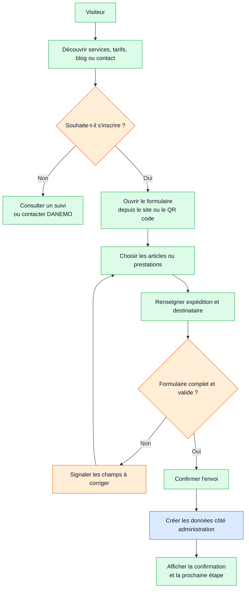

# Workflow 05 — Inscription et parcours public

**Priorité :** P1 / P2 · **Rôle :** client public

À valider : formulaire, pièces éventuelles, protection anti-abus, consentements et traitement administratif.
