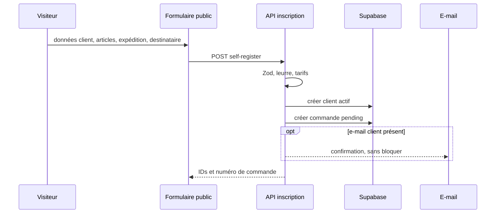
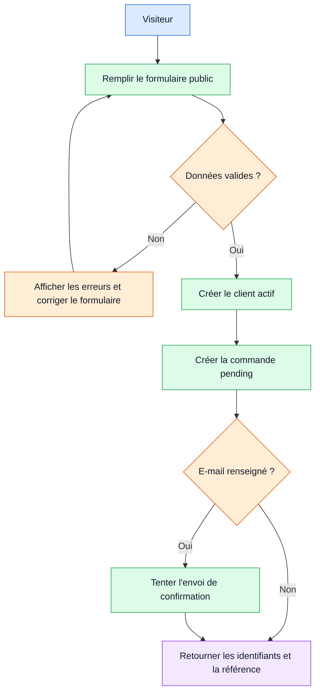

# Workflow 05 — Inscription et parcours public

## Objectif

Transformer une demande publique en fiche client active et commande `pending`, sans créer de compte de connexion client. Les pages publiques comprennent notamment accueil, services, tarifs, blog, contact et suivi.

## Acteurs et autorisations

| Acteur | Droit |
| --- | --- |
| Visiteur | Envoyer une demande auto-inscrite; consulter tarifs, départ proche, blog public et suivi. |
| Équipe interne | Reprendre le client et la commande créés dans le back-office. |

## Points d'entrée

- `POST /api/public/self-register`
- `GET /api/public/tariff-items`, `GET /api/public/upcoming-departure`, `GET /api/public/blog-posts`
- Pages `app/page.tsx`, `app/services/page.tsx`, `app/tarifs/page.tsx`, `app/contact/page.tsx`, `app/blog/page.tsx`, `app/tracking/page.tsx`

## Déroulé

1. Le visiteur choisit au moins un article du catalogue ou une prestation personnalisée, puis renseigne ses coordonnées, l'expédition et le destinataire.
2. Le serveur valide le schéma Zod, vérifie le champ leurre `company_website` et la validité des index tarifaires.
3. Il crée un client actif. Les articles et un éventuel message sont ajoutés aux notes de la fiche.
4. Il génère un numéro de commande et crée une commande `pending` avec les informations d'expédition, description d'articles et lien au client.
5. Si le client a fourni un e-mail, une confirmation est tentée. Son échec ne remet pas en cause la réponse de création.
6. Le client reçoit les identifiants client, commande et numéro de commande dans la réponse, pas une session.

## Diagramme principal

## Diagramme simplifié

## Règles métier et sécurité

- Cinq requêtes par 15 minutes sont autorisées par identifiant client, par instance applicative.
- Sont requis : identité et coordonnées client, au moins un article, service, origine, destination et coordonnées du destinataire. Les quantités sont bornées; 25 articles au plus.
- Services autorisés : `fret_maritime`, `fret_aerien`, `demenagement`, `dedouanement`, `negoce`.
- L'e-mail client est facultatif, mais s'il est fourni il est normalisé et unique. Un doublon renvoie 409.

## Effets de bord

- Écritures `customers` puis `orders`; le trigger de commande peut générer son QR.
- E-mail de confirmation si une adresse est fournie et la configuration e-mail est opérationnelle.

## Échecs et cas limites

- Données invalides, leurre rempli ou référence tarifaire inconnue : 400.
- Duplication d'e-mail : 409; le message conseille de contacter DANEMO ou de suivre une commande.
- Une panne e-mail est seulement journalisée : l'inscription reste réussie.
- À confirmer : aucun consentement explicite SMS/WhatsApp ni pièce jointe n'est demandé par cette API publique.

## Tests de recette

1. Soumettre un catalogue valide avec et sans e-mail : contrôler création client/commande et absence de compte Auth.
2. Envoyer zéro article, un index hors catalogue, un champ leurre rempli et un e-mail invalide : contrôler 400.
3. Soumettre deux fois le même e-mail : contrôler le 409 à la seconde requête.
4. Indisponibiliser le service mail dans un environnement de test : contrôler le 201 et le journal d'échec.

## Références code

- `app/api/public/self-register/route.ts`, `app/api/public/tariff-items/route.ts`, `app/api/public/upcoming-departure/route.ts`
- `lib/tariff-items.ts`, `lib/database.ts`, `lib/notify.ts`, `lib/notification-templates.ts`, `proxy.ts`
