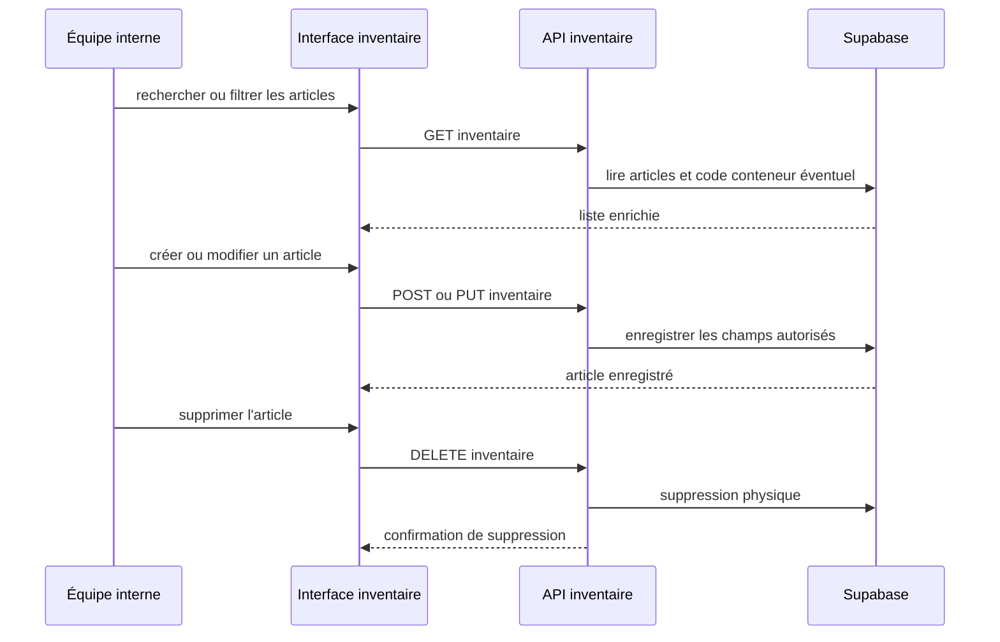
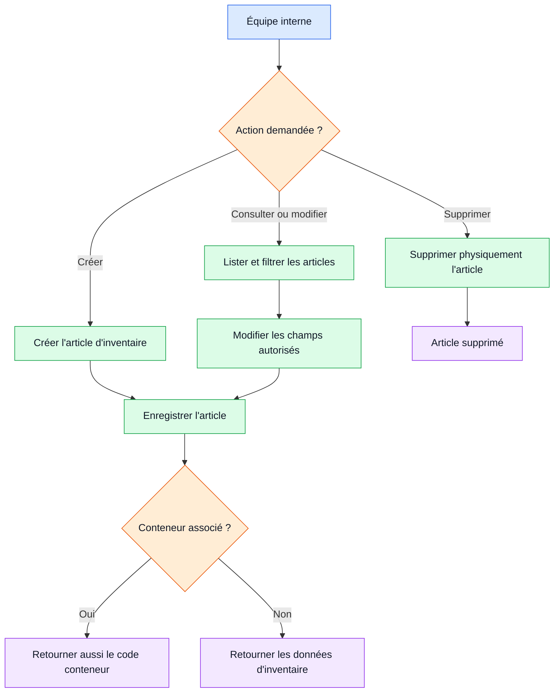

# Workflow 06 — Inventaire et suppression

## Objectif

Gérer les articles physiques (`colis`, `vehicule`, `marchandise`), leur emplacement et leur association éventuelle à un conteneur. Documenter sans masquer que la suppression est actuellement immédiate.

## Acteurs et autorisations

| Acteur | Droit |
| --- | --- |
| Opérateur / administrateur actif | Lire, créer, modifier et supprimer les articles d'inventaire. |
| Visiteur | Aucun accès à l'inventaire. |

## Points d'entrée

- `GET, POST /api/inventory`; `GET, PUT, DELETE /api/inventory/[id]`
- Le scan QR concerne les commandes ; il ne crée ni ne préremplit un article d'inventaire.

## Déroulé

1. L'équipe liste les articles, avec recherche par référence/description/client et filtres type/statut.
2. Le serveur enrichit la lecture du code conteneur lorsque `container_id` est présent.
3. À la création, les données sont insérées telles que reçues, sauf une chaîne vide de conteneur convertie en `null`.
4. À la modification, seuls type, référence, description, client, statut, localisation, poids, dimensions, valeur et conteneur sont retenus.
5. La suppression exécute un `DELETE` direct sur l'identifiant fourni.

## Diagramme principal

## Diagramme simplifié

## Règles métier et sécurité

- Valeurs contrôlées par la base : types `colis`, `vehicule`, `marchandise`; statuts `en_stock`, `en_transit`, `livre`, `en_attente`.
- Référence unique, description, client, statut, localisation et valeur requis par le schéma SQL.
- Le handler de création ne valide pas explicitement ces champs : la contrainte SQL devient le dernier rempart.
- Toute opération requiert une session interne active; l'autorisation n'est pas restreinte à l'administrateur.

## Effets de bord

- Écriture ou suppression dans `inventory`; mise à jour automatique de `updated_at` par trigger SQL.
- Aucun audit métier, e-mail, SMS ou événement de suivi n'est produit par les routes d'inventaire.

## Échecs et cas limites

- La suppression n'est ni archivage, ni réversible, ni confirmée côté serveur. Elle est également autorisée à l'opérateur. **À confirmer comme règle métier.**
- Le scan QR ne concerne pas l'inventaire ; l'affirmation d'un préremplissage d'inventaire par scan n'est pas étayée par les routes.
- Une valeur de type/statut non valide est rejetée par la base et devient actuellement une erreur générique 500 de l'API.

## Tests de recette

1. Créer un article de chaque type/statut et vérifier le filtrage et le code conteneur enrichi.
2. Modifier un champ autorisé puis un champ non autorisé : vérifier que le second est ignoré.
3. Tenter une référence dupliquée et un statut invalide : contrôler que la création échoue sans nouvelle ligne.
4. En environnement de test, supprimer un article avec compte opérateur et vérifier le caractère physique de l'opération.

## Références code

- `app/api/inventory/route.ts`, `app/api/inventory/[id]/route.ts`, `app/api/qr/scan/route.ts`
- `lib/staff-api-auth.ts`, `supabase/migrations/0001_initial_schema.sql`
