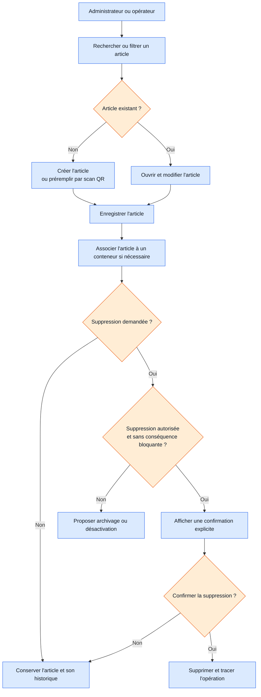

# Workflow 06 — Inventaire et suppression contrôlée

**Priorité :** P1 · **Rôles :** administrateur, opérateur (suppression : administrateur)

Ce même contrôle s'applique aux collaborateurs et aux contenus de blog, suivant leurs règles d'autorisation.
