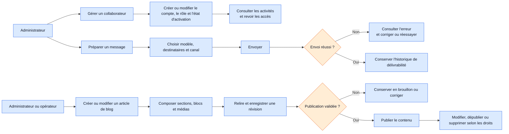

# Workflow 07 — Collaborateurs, messagerie et blog

**Priorité :** P1 · **Rôles :** administrateur ; administrateur ou opérateur pour le blog

À valider : droits d'administration, règles de publication, destinataires et erreurs d'envoi.
