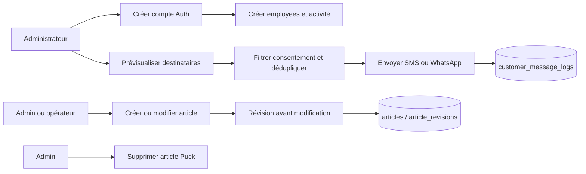

# Workflow 07 — Collaborateurs, messagerie et contenu éditorial

## Objectif

Administrer les accès internes, envoyer des campagnes SMS/WhatsApp et gérer les deux systèmes de contenu actuellement présents : les articles Supabase/Puck avec révisions et les billets historiques JSON.

## Acteurs et autorisations

| Acteur | Droits |
| --- | --- |
| Administrateur | CRUD collaborateurs et activités, aperçu/envoi de campagnes, suppression d'article Puck. |
| Opérateur | Lire/créer/modifier articles Puck et révisions, gérer billets historiques et médias. |
| Visiteur | Lire les routes de blog publiques prévues, sans mutation. |

## Points d'entrée

- `GET, POST /api/employees`, `GET, PUT, DELETE /api/employees/[id]`, `GET, POST /api/employees/[id]/activities`
- `GET, POST /api/admin/messages/send`
- `GET, POST /api/admin/articles`, `GET, PATCH, DELETE /api/admin/articles/[id]`, `GET, POST /api/admin/article-revisions`
- `GET, POST, PUT, DELETE /api/blog-posts`, `POST /api/blog-media`

## Déroulé

1. Un administrateur crée d'abord un utilisateur Supabase Auth avec mot de passe initial et rôle dans `app_metadata`, puis une fiche `employees` liée. En cas d'échec de cette seconde écriture, le compte Auth est supprimé.
2. La mise à jour synchronise l'e-mail, le mot de passe éventuel et le rôle serveur avec la fiche collaborateur. La suppression supprime fiche puis utilisateur Auth.
3. Une campagne admin sélectionne ses destinataires par client, conteneur, ville ou tous les clients actifs, filtre le consentement pour une campagne non transactionnelle, déduplique les numéros et limite à 500.
4. Chaque tentative Twilio est consignée `sent` ou `failed`; le résultat retourne au plus dix erreurs.
5. Les articles Puck peuvent être créés/modifiés par les deux rôles; une modification crée par défaut une révision de l'état précédent. Seul l'administrateur les supprime.
6. Les billets historiques suivent une API séparée; les deux rôles peuvent aussi les supprimer. Un média doit être image/vidéo, au plus 50 Mo, et est rendu public dans le bucket `blog-media`.

## Diagramme principal

## Règles métier et sécurité

- Collaborateurs : rôle strictement `admin` ou `operator`; l'accès réel exige ensuite la cohérence Auth/`employees` et `is_active`.
- L'aperçu et l'envoi de campagne sont administrateur uniquement. Un message doit faire 10 à 1 000 caractères et le canal est `sms` ou `whatsapp`.
- Une campagne transactionnelle peut contourner le consentement; une campagne ordinaire ne cible que les clients ayant opt-in pour le canal.
- Les articles Puck acceptent un statut défini dans leur type; la suppression est admin uniquement. L'API historique `blog-posts` a des règles différentes et ses mutations acceptent les deux rôles.

## Effets de bord

- Création/mise à jour/suppression Supabase Auth et tables collaborateurs; création d'une activité initiale de type `login` à la création.
- Appels Twilio un par destinataire et journalisation de chaque tentative.
- Écriture d'articles, révisions et métadonnées de média; le média est dans un bucket public.
- Les billets historiques appellent aussi l'audit métier; les articles Puck ne l'appellent pas dans les handlers inspectés.

## Échecs et cas limites

- La suppression d'un collaborateur est physique et supprime le compte Auth; une désactivation est préférable si la conservation d'historique est requise.
- L'écriture d'activité accepte largement le corps fourni par un administrateur; les types sont finalement contraints par SQL.
- Deux systèmes éditoriaux coexistent, avec contrôles et persistance distincts. **À confirmer : lequel est la source éditoriale de référence.**
- Le bucket média est public; ne pas téléverser de document confidentiel.

## Tests de recette

1. Créer puis désactiver un opérateur test : contrôler rôle dans les deux emplacements et refus API après désactivation.
2. Prévisualiser une campagne non transactionnelle avec clients opt-in/non opt-in, puis utiliser `dryRun` et vérifier qu'aucun message n'est expédié.
3. Envoyer une campagne sur environnement de test et vérifier les lignes `sent`/`failed` sans afficher de téléphone complet dans les supports.
4. Modifier un article Puck : vérifier la révision; tenter sa suppression comme opérateur (403) puis administrateur.
5. Téléverser un média de 50 Mo puis un format non image/vidéo : vérifier les contrôles.

## Références code

- `app/api/employees/route.ts`, `app/api/employees/[id]/route.ts`, `app/api/employees/[id]/activities/route.ts`
- `app/api/admin/messages/send/route.ts`, `lib/messaging.ts`, `supabase/migrations/20260502190000_add_customer_messaging.sql`
- `app/api/admin/articles/route.ts`, `app/api/admin/articles/[id]/route.ts`, `app/api/admin/article-revisions/route.ts`, `app/api/blog-posts/route.ts`, `app/api/blog-media/route.ts`
- `lib/articles.ts`, `lib/blog-posts.ts`, `supabase/migrations/20260504000100_blog_articles.sql`
