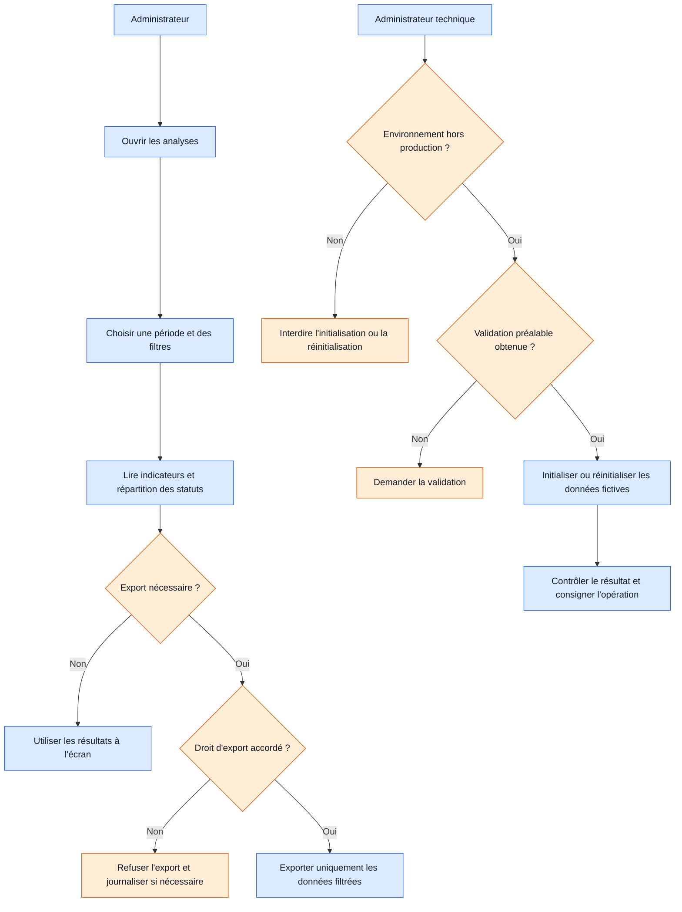

# Workflow 08 — Analyses, exports et données de démonstration

**Priorité :** P2 · **Rôles :** administrateur, administrateur technique

Les exports doivent cadrer le périmètre de données et leur conservation. Les opérations de démonstration ne visent jamais la production.
