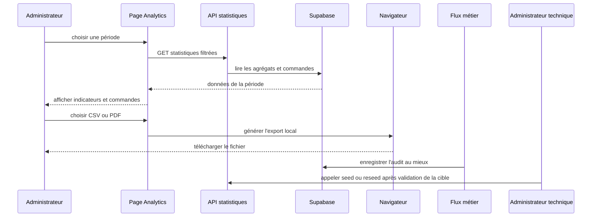
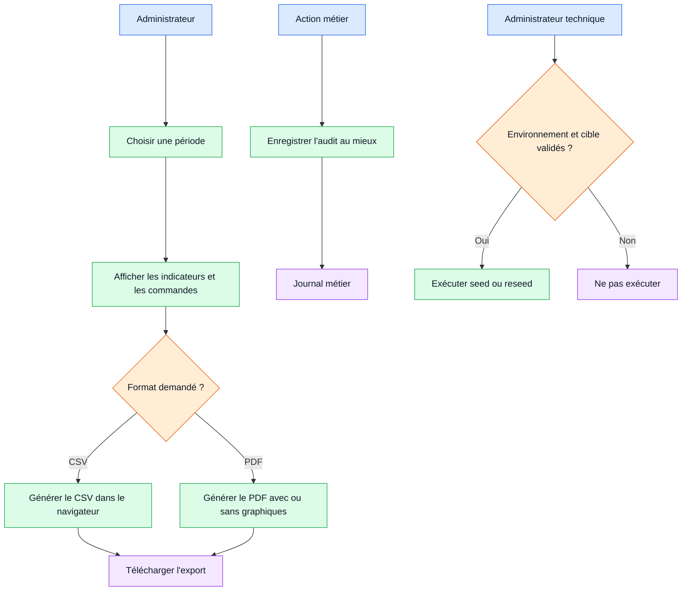

# Workflow 08 — Analyses, exports, audit et données de démonstration

## Objectif

Consulter les agrégats de commandes, exporter les données visibles depuis le navigateur et encadrer les routes de seed/reseed réservées à un environnement de démonstration.

## Acteurs et autorisations

| Acteur | Droit |
| --- | --- |
| Administrateur actif | Lire `GET /api/stats`, consulter Analytics et exporter depuis le navigateur. |
| Opérateur | Exclu de la page Analytics et de l'API statistiques. |
| Administrateur technique | Utilise les routes de seed/reseed seulement avec les contrôles propres à ces routes et hors production. |

## Points d'entrée

- Page `app/admin/analytics/page.tsx` et `GET /api/stats?start_date=…`
- Fonctions client `lib/export-utils.ts` (CSV, PDF avec ou sans graphiques).
- Routes `app/api/admin/seed-*/route.ts` et `app/api/admin/reseed-data/route.ts`.
- `business_audit_log`, alimenté par les flux de clients, commandes, paiements, conteneurs et billets historiques.

## Déroulé

1. L'administrateur choisit une période; la route statistique transmet `start_date` à `utils.getStats`.
2. L'écran compose les indicateurs et la liste des commandes selon ses données chargées.
3. L'export CSV est créé entièrement dans le navigateur. Il contient la période, les totaux, puis le détail des commandes affichées.
4. L'export PDF est aussi local; il peut tenter de capturer les graphiques puis basculer vers une version simple en cas de problème `oklch`.
5. Les actions métier principales écrivent un journal au mieux : l'échec de l'audit est attrapé pour ne pas bloquer l'opération.
6. Les routes de démo ne font pas partie d'un parcours utilisateur normal et ne doivent jamais être appelées durant une recette de lecture.

## Diagramme principal

## Diagramme simplifié

## Règles métier et sécurité

- L'accès statistiques est contrôlé deux fois : proxy et `requireAdminApiAccess`.
- Le CSV/PDF incorpore les données déjà présentes dans le navigateur, dont noms expéditeur/destinataire et valeur de commande : appliquer la politique interne de conservation avant diffusion.
- Le journal métier stocke acteur, rôle, action, type/identifiant d'entité et métadonnées; il est accessible en base au `service_role`, pas aux rôles anon/authenticated.
- Aucune planification versionnée n'appelle `update_overdue_invoices()` : le passage automatique de facture en retard n'est pas garanti.

## Effets de bord

- Téléchargement local de CSV/PDF sans endpoint d'export dédié ni journal d'export.
- Écriture d'audit non bloquante pour les handlers concernés.
- Les routes de seed/reseed peuvent créer ou remplacer de nombreuses données selon leur implémentation : elles ne doivent pas être déclenchées par les contrôles de documentation.

## Échecs et cas limites

- Un `start_date` invalide peut échouer dans la couche de données; la route répond alors 500, sans validation explicite du format.
- L'export PDF limite le détail à 20 commandes dans les fonctions inspectées; le CSV ne suit pas cette limite.
- Les routes de seed ne présentent pas toutes le même mécanisme d'autorisation dans les handlers. **À confirmer et renforcer avant toute exposition hors développement.**
- À confirmer : aucune rétention, anonymisation ou journalisation des exports n'est implémentée.

## Tests de recette

1. Connecter un administrateur puis un opérateur : contrôler succès/403 de `GET /api/stats` et l'accès page.
2. Changer la période et comparer les indicateurs avec les commandes filtrées.
3. Exporter CSV et PDF sur données synthétiques : vérifier l'en-tête de période, les statuts et la limite PDF.
4. Vérifier qu'un changement client, commande, paiement ou conteneur produit un audit; simuler l'indisponibilité de l'audit et contrôler que l'action principale reste possible.
5. Ne lancer un seed/reseed que dans un projet éphémère explicitement désigné, après sauvegarde et validation de la cible.

## Références code

- `app/admin/analytics/page.tsx`, `app/api/stats/route.ts`, `lib/database.ts`, `lib/export-utils.ts`
- `lib/business-audit.ts`, `supabase/migrations/20260903000400_add_business_audit_log.sql`
- `app/api/admin/seed-users/route.ts`, `app/api/admin/seed-customers/route.ts`, `app/api/admin/seed-orders/route.ts`, `app/api/admin/seed-containers/route.ts`, `app/api/admin/reseed-data/route.ts`
- `supabase/migrations/0001_initial_schema.sql`, `scripts/smoke-business-workflows.mjs`
