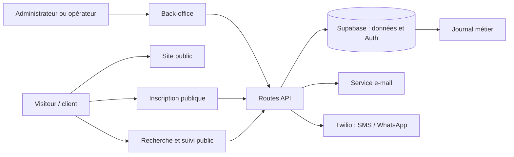

# Référentiel opérationnel DANEMO

Cette documentation décrit le comportement actuellement livré par l'application. Elle s'appuie sur les routes, services et migrations versionnés ; elle ne remplace pas une décision métier. Les rubriques **À confirmer** signalent donc un comportement absent, ambigu ou risqué dans le code.

## Carte globale

## Rôles

| Rôle | Source d'autorisation | Périmètre constaté |
| --- | --- | --- |
| Visiteur / client | Aucun compte requis pour les routes publiques | Site, inscription, recherche et suivi public, données de conteneur filtrées. |
| Opérateur | Session NextAuth, rôle `operator` dans `app_metadata`, fiche `employees` active et de même rôle | Clients, commandes, conteneurs, inventaire, suivi, QR et contenus éditoriaux. |
| Administrateur | Mêmes contrôles, rôle `admin` | Tous les droits opérateur, plus collaborateurs, statistiques, envoi SMS/WhatsApp et routes techniques administratives. |

Le proxy filtre les chemins, mais les handlers métier refont le contrôle via `requireStaffApiAccess` ou `requireAdminApiAccess`. Une session seule ne suffit pas : un compte désactivé ou dont les deux rôles divergent est refusé.

## Documents par domaine

| Document | Domaine | Accès principal |
| --- | --- | --- |
| [01 — Connexion et rôles](01-connexion-et-roles.md) | Authentification, autorisation, récupération du mot de passe | Interne |
| [02 — Client, commande et règlement](02-client-commande-reglement.md) | Référentiel client, commandes, paiements, factures | Interne |
| [03 — Conteneur et statut](03-conteneur-et-statut.md) | Expédition, affectation, changements de statut | Interne / public filtré |
| [04 — Suivi, QR et accès public](04-suivi-qr-et-acces-public.md) | Événements de suivi, recherche, QR | Mixte |
| [05 — Inscription et parcours public](05-inscription-et-parcours-public.md) | Création publique d'un client et d'une commande | Public |
| [06 — Inventaire et suppression](06-inventaire-et-suppression.md) | Articles d'inventaire et suppression physique | Interne |
| [07 — Collaborateurs, messagerie et blog](07-collaborateurs-messagerie-et-blog.md) | Comptes internes, campagnes, contenu | Interne |
| [08 — Analyses, exports et démonstration](08-analyses-exports-et-demonstration.md) | Indicateurs, export navigateur, données de démo | Administrateur |

## Matrice rôle × workflow

| Workflow | Visiteur | Opérateur | Administrateur |
| --- | :---: | :---: | :---: |
| Connexion, réinitialisation | — | ✓ | ✓ |
| Client, commande, règlement, facture | — | ✓ | ✓ |
| Conteneur, suivi, inventaire, QR | Lecture publique limitée | ✓ | ✓ |
| Inscription et suivi public | ✓ | — | — |
| Collaborateurs, statistiques, campagnes | — | — | ✓ |
| Articles, révisions, médias, blog historique | Lecture publique selon route | ✓ | ✓ |

## Conventions de lecture

- Les chemins précédés de `GET`, `POST`, `PUT`, `PATCH` ou `DELETE` sont des contrats API ; la majorité répondent `{ success, data, error }`.
- « Écriture » désigne un effet durable dans Supabase ou dans le stockage de contenu. L'envoi e-mail/SMS est un effet externe et peut échouer après l'écriture principale.
- Les statuts listés sont les valeurs imposées par les migrations ou contrôlées par les routes, pas une recommandation de processus.
- Les tests de recette sont manuels et sans envoi réel lorsque l'action appelle un fournisseur externe. Le script `scripts/smoke-business-workflows.mjs` couvre le CRUD local client/conteneur/commande avec nettoyage.

## Frontières connues

- Aucun webhook entrant ni tâche planifiée versionnée n'a été identifié. La fonction SQL `update_overdue_invoices()` existe, mais aucun ordonnanceur n'est configuré dans le dépôt.
- Le limiteur de requêtes du proxy est en mémoire : son compteur n'est pas partagé entre instances et redémarre avec le processus.
- Les suppressions actuelles sont physiques. Vérifier les impacts métier avant usage, car l'API ne demande pas de confirmation serveur ni ne propose d'archivage.
